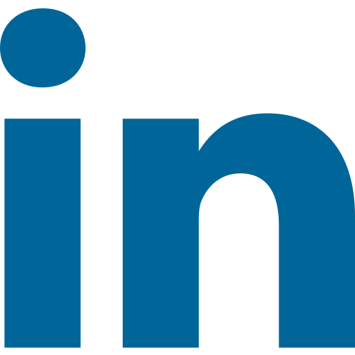

  

  

  

<h2 align="center">🛠️ My Tech Stack</h2>

**Languages**  

**Frameworks & Libraries**  

**Platforms & Databases**  

**IDEs & Editors**  

**Tools & Design**  

  <h2 align="center">    &nbspCollaboration</h2>
  
I'm open to collaborating on open-source development projects and contributing to impactful software solutions.

  

  

  

<h2 align="center">&nbspLet's Connect</h2>

  
  
  
  
  

